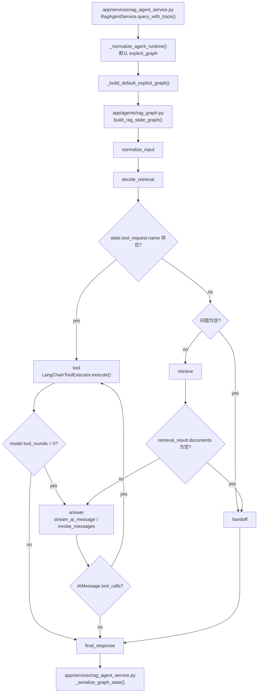

# Agent 显式图与工具分支

该图描述默认 `explicit_graph` runtime 下 LangGraph 状态图的主要节点和分支。没有 pre-retrieval planner：`decide_retrieval` 仅在显式 `tool_request` 时走工具；常规问答走检索，答案阶段可因模型 `tool_calls` 进入 answer↔tool 续轮。

```mermaid
flowchart TD
    A["app/services/rag_agent_service.py<br/>RagAgentService.query_with_trace()"] --> B["_normalize_agent_runtime()<br/>默认 explicit_graph"]
    B --> C["_build_default_explicit_graph()"]
    C --> D["app/agents/rag_graph.py<br/>build_rag_state_graph()"]
    D --> E["normalize_input"]
    E --> F["decide_retrieval"]
    F --> G{"state.tool_request.name 存在?"}
    G -- yes --> H["tool<br/>LangChainToolExecutor.execute()"]
    G -- no --> I{"问题为空?"}
    I -- yes --> J["handoff"]
    I -- no --> N["retrieve"]
    H --> O{"model tool_rounds > 0?"}
    O -- yes --> Q
    O -- no --> S
    N --> P{"retrieval_result.documents 为空?"}
    P -- yes --> J
    P -- no --> Q["answer<br/>stream_ai_message / invoke_messages"]
    Q --> R{"AIMessage.tool_calls?"}
    R -- yes --> H
    R -- no --> S["final_response"]
    J --> S
    S --> T["app/services/rag_agent_service.py<br/>_serialize_graph_state()"]
```
