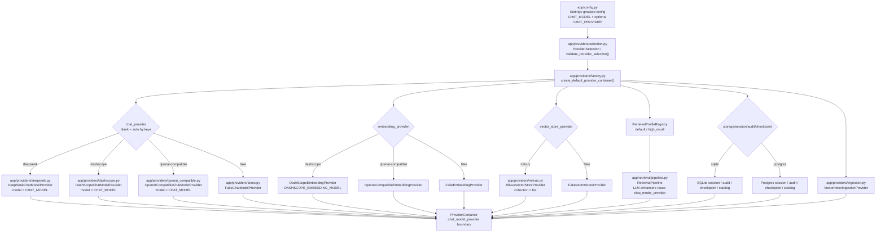

# Provider、模型与 Embedding 装配

该图描述 `create_default_provider_container()` 如何根据配置装配 chat、embedding、vector store、retrieval、session、audit、ingestion 和 checkpoint provider。

默认关系：**DeepSeek chat + DashScope embedding**。`CHAT_PROVIDER` 留空时按有效 Key 自动选择 chat provider（双有效 chat Key 时 DeepSeek-first）；所有 chat 分支只使用共享 `CHAT_MODEL`。DashScope embedding 使用独立的 `DASHSCOPE_EMBEDDING_MODEL`，与 `CHAT_MODEL` 解耦。检索增强器需要 LLM 时复用 `ProviderContainer.chat_model_provider`。

