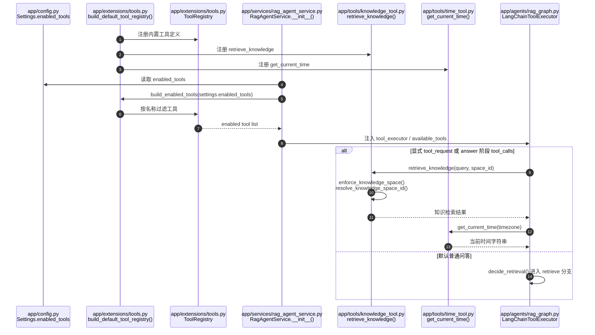

# 工具注册与内置工具

该图描述默认工具注册、启用工具过滤、知识库检索工具和当前时间工具如何进入 `RagAgentService`。没有 pre-retrieval planner：工具由显式 `tool_request` 或 answer 阶段模型 `tool_calls`（answer↔tool 续轮）触发。

```mermaid
sequenceDiagram
    autonumber
    participant Settings as app/config.py<br/>Settings.enabled_tools
    participant Extensions as app/extensions/tools.py<br/>build_default_tool_registry()
    participant Registry as app/extensions/tools.py<br/>ToolRegistry
    participant Service as app/services/rag_agent_service.py<br/>RagAgentService.__init__()
    participant Knowledge as app/tools/knowledge_tool.py<br/>retrieve_knowledge()
    participant Time as app/tools/time_tool.py<br/>get_current_time()
    participant Graph as app/agents/rag_graph.py<br/>LangChainToolExecutor

    Extensions->>Registry: 注册内置工具定义
    Extensions->>Knowledge: 注册 retrieve_knowledge
    Extensions->>Time: 注册 get_current_time
    Service->>Settings: 读取 enabled_tools
    Service->>Extensions: build_enabled_tools(settings.enabled_tools)
    Extensions->>Registry: 按名称过滤工具
    Registry-->>Service: enabled tool list
    Service->>Graph: 注入 tool_executor / available_tools
    alt 显式 tool_request 或 answer 阶段 tool_calls
        Graph->>Knowledge: retrieve_knowledge(query, space_id)
        Knowledge->>Knowledge: enforce_knowledge_space()<br/>resolve_knowledge_space_id()
        Knowledge-->>Graph: 知识检索结果
        Graph->>Time: get_current_time(timezone)
        Time-->>Graph: 当前时间字符串
    else 默认普通问答
        Graph->>Graph: decide_retrieval() 进入 retrieve 分支
    end
```
