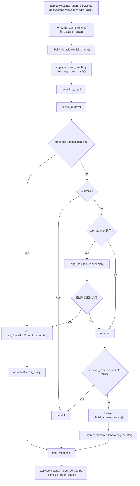

# Agent 显式图与工具分支

该图描述默认 `explicit_graph` runtime 下 LangGraph 状态图的主要节点和分支。`TOOL_PLANNING_ENABLED` 默认关闭，因此常规问答默认走检索分支。

```mermaid
flowchart TD
    A["app/services/rag_agent_service.py<br/>RagAgentService.query_with_trace()"] --> B["_normalize_agent_runtime()<br/>默认 explicit_graph"]
    B --> C["_build_default_explicit_graph()"]
    C --> D["app/agents/rag_graph.py<br/>build_rag_state_graph()"]
    D --> E["normalize_input"]
    E --> F["decide_retrieval"]
    F --> G{"state.tool_request.name 存在?"}
    G -- yes --> H["tool<br/>LangChainToolExecutor.execute()"]
    G -- no --> I{"问题为空?"}
    I -- yes --> J["handoff"]
    I -- no --> K{"tool_planner 启用?"}
    K -- yes --> L["LangChainToolPlanner.plan()"]
    L --> M{"模型规划工具调用?"}
    M -- yes --> H
    M -- no --> N["retrieve"]
    K -- no --> N
    H --> O["answer 或 error_policy"]
    N --> P{"retrieval_result.documents 为空?"}
    P -- yes --> J
    P -- no --> Q["answer<br/>_build_answer_prompt()"]
    Q --> R["ChatModelAnswerGenerator.generate()"]
    R --> S["final_response"]
    J --> S
    O --> S
    S --> T["app/services/rag_agent_service.py<br/>_serialize_graph_state()"]
```
