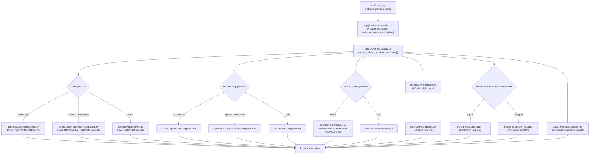

# Provider、模型与 Embedding 装配

该图描述 `create_default_provider_container()` 如何根据配置装配 chat、embedding、vector store、retrieval、session、audit、ingestion 和 checkpoint provider。

```mermaid
flowchart TD
    A["app/config.py<br/>Settings grouped config"] --> B["app/providers/selection.py<br/>ProviderSelection / validate_provider_selection()"]
    B --> C["app/providers/factory.py<br/>create_default_provider_container()"]
    C --> D{"chat_provider"}
    D -- dashscope --> E["app/providers/dashscope.py<br/>DashScopeChatModelProvider"]
    D -- openai-compatible --> F["app/providers/openai_compatible.py<br/>OpenAICompatibleChatModelProvider"]
    D -- fake --> G["app/providers/fakes.py<br/>FakeChatModelProvider"]
    C --> H{"embedding_provider"}
    H -- dashscope --> I["DashScopeEmbeddingProvider"]
    H -- openai-compatible --> J["OpenAICompatibleEmbeddingProvider"]
    H -- fake --> K["FakeEmbeddingProvider"]
    C --> L{"vector_store_provider"}
    L -- milvus --> M["app/providers/milvus.py<br/>MilvusVectorStoreProvider<br/>collection = biz"]
    L -- fake --> N["FakeVectorStoreProvider"]
    C --> O["RetrievalProfileRegistry<br/>default / high_recall"]
    O --> P["app/retrieval/pipeline.py<br/>RetrievalPipeline"]
    C --> Q{"storage/session/audit/checkpoint"}
    Q -- sqlite --> R["SQLite session / audit / checkpoint / catalog"]
    Q -- postgres --> S["Postgres session / audit / checkpoint / catalog"]
    C --> T["app/providers/ingestion.py<br/>VectorIndexIngestionProvider"]
    E --> U["ProviderContainer"]
    F --> U
    G --> U
    I --> U
    J --> U
    K --> U
    M --> U
    N --> U
    P --> U
    R --> U
    S --> U
    T --> U
```
