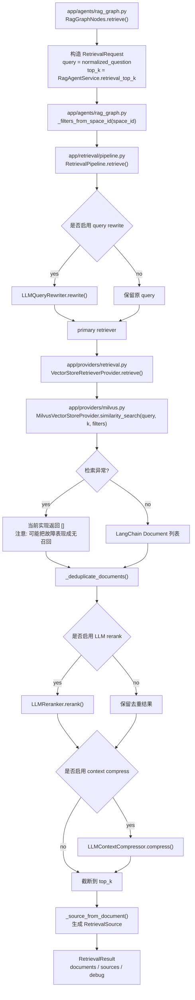

# RAG 检索 Pipeline

该图描述显式 RAG 图进入检索节点后，`RetrievalPipeline.retrieve()` 如何组织 query rewrite、向量检索、去重、rerank、compress 和 source 序列化。

```mermaid
flowchart TD
    A["app/agents/rag_graph.py<br/>RagGraphNodes.retrieve()"] --> B["构造 RetrievalRequest<br/>query = normalized_question<br/>top_k = RagAgentService.retrieval_top_k"]
    B --> C["app/agents/rag_graph.py<br/>_filters_from_space_id(space_id)"]
    C --> D["app/retrieval/pipeline.py<br/>RetrievalPipeline.retrieve()"]
    D --> E{"是否启用 query rewrite"}
    E -- yes --> F["LLMQueryRewriter.rewrite()"]
    E -- no --> G["保留原 query"]
    F --> H["primary retriever"]
    G --> H
    H --> I["app/providers/retrieval.py<br/>VectorStoreRetrieverProvider.retrieve()"]
    I --> J["app/providers/milvus.py<br/>MilvusVectorStoreProvider.similarity_search(query, k, filters)"]
    J --> K{"检索异常?"}
    K -- yes --> L["当前实现返回 []<br/>注意: 可能把故障表现成无召回"]
    K -- no --> M["LangChain Document 列表"]
    L --> N["_deduplicate_documents()"]
    M --> N
    N --> O{"是否启用 LLM rerank"}
    O -- yes --> P["LLMReranker.rerank()"]
    O -- no --> Q["保留去重结果"]
    P --> R{"是否启用 context compress"}
    Q --> R
    R -- yes --> S["LLMContextCompressor.compress()"]
    R -- no --> T["截断到 top_k"]
    S --> T
    T --> U["_source_from_document()<br/>生成 RetrievalSource"]
    U --> V["RetrievalResult<br/>documents / sources / debug"]
```
