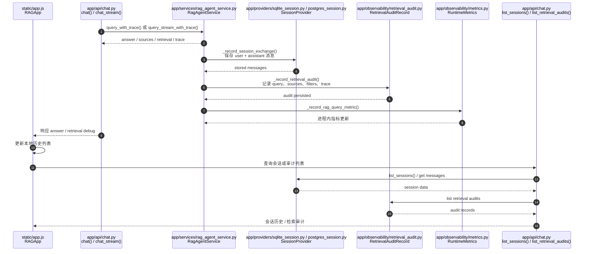

# 会话历史与检索审计

该图描述一次问答完成后，后端如何记录会话消息、检索审计和运行指标，以及前端和 API 如何读取这些信息。

```mermaid
sequenceDiagram
    autonumber
    participant UI as static/app.js<br/>RAGApp
    participant ChatAPI as app/api/chat.py<br/>chat() / chat_stream()
    participant Service as app/services/rag_agent_service.py<br/>RagAgentService
    participant Session as app/providers/sqlite_session.py / postgres_session.py<br/>SessionProvider
    participant Audit as app/observability/retrieval_audit.py<br/>RetrievalAuditRecord
    participant Metrics as app/observability/metrics.py<br/>RuntimeMetrics
    participant ListAPI as app/api/chat.py<br/>list_sessions() / list_retrieval_audits()

    ChatAPI->>Service: query_with_trace() 或 query_stream_with_trace()
    Service-->>ChatAPI: answer / sources / retrieval / trace
    Service->>Session: _record_session_exchange()<br/>保存 user + assistant 消息
    Session-->>Service: stored messages
    Service->>Audit: _record_retrieval_audit()<br/>记录 query、sources、filters、trace
    Audit-->>Service: audit persisted
    Service->>Metrics: _record_rag_query_metric()
    Metrics-->>Service: 进程内指标更新
    ChatAPI-->>UI: 响应 answer / retrieval debug
    UI->>UI: 更新本地历史列表

    UI->>ListAPI: 查询会话或审计列表
    ListAPI->>Session: list_sessions() / get messages
    Session-->>ListAPI: session data
    ListAPI->>Audit: list retrieval audits
    Audit-->>ListAPI: audit records
    ListAPI-->>UI: 会话历史 / 检索审计
```
