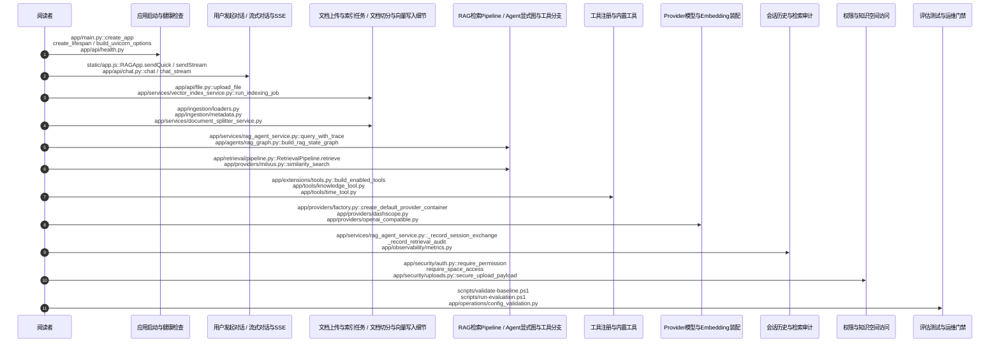

# 功能覆盖索引

该索引用一张轻量图说明本目录的 Mermaid 文档如何覆盖 RAGqs 的主要代码路径。图集基于 `openspec/changes/learn-rag-agent-codebase/tutorial.md`，只描述当前代码库可确认的行为。

```mermaid
sequenceDiagram
    autonumber
    participant Reader as 阅读者
    participant Startup as 应用启动与健康检查
    participant Chat as 用户发起对话 / 流式对话与SSE
    participant Ingestion as 文档上传与索引任务 / 文档切分与向量写入细节
    participant RAG as RAG检索Pipeline / Agent显式图与工具分支
    participant Tools as 工具注册与内置工具
    participant Providers as Provider模型与Embedding装配
    participant State as 会话历史与检索审计
    participant Security as 权限与知识空间访问
    participant Ops as 评估测试与运维门禁

    Reader->>Startup: app/main.py::create_app<br/>create_lifespan / build_uvicorn_options<br/>app/api/health.py
    Reader->>Chat: static/app.js::RAGApp.sendQuick / sendStream<br/>app/api/chat.py::chat / chat_stream
    Reader->>Ingestion: app/api/file.py::upload_file<br/>app/services/vector_index_service.py::run_indexing_job
    Reader->>Ingestion: app/ingestion/loaders.py<br/>app/ingestion/metadata.py<br/>app/services/document_splitter_service.py
    Reader->>RAG: app/services/rag_agent_service.py::query_with_trace<br/>app/agents/rag_graph.py::build_rag_state_graph
    Reader->>RAG: app/retrieval/pipeline.py::RetrievalPipeline.retrieve<br/>app/providers/milvus.py::similarity_search
    Reader->>Tools: app/extensions/tools.py::build_enabled_tools<br/>app/tools/knowledge_tool.py<br/>app/tools/time_tool.py
    Reader->>Providers: app/providers/factory.py::create_default_provider_container<br/>app/providers/dashscope.py<br/>app/providers/openai_compatible.py
    Reader->>State: app/services/rag_agent_service.py::_record_session_exchange<br/>_record_retrieval_audit<br/>app/observability/metrics.py
    Reader->>Security: app/security/auth.py::require_permission<br/>require_space_access<br/>app/security/uploads.py::secure_upload_payload
    Reader->>Ops: scripts/validate-baseline.ps1<br/>scripts/run-evaluation.ps1<br/>app/operations/config_validation.py
```
