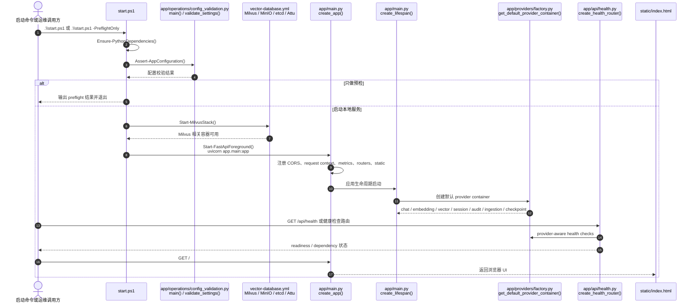

# 应用启动与健康检查

该图描述本地启动脚本、FastAPI 应用创建、生命周期初始化、静态页面和健康检查之间的关系。Milvus、provider 和配置校验的细节只保留到入口层级。

```mermaid
sequenceDiagram
    autonumber
    actor Ops as 启动命令或运维调用方
    participant Start as start.ps1
    participant ConfigCheck as app/operations/config_validation.py<br/>main() / validate_settings()
    participant Compose as vector-database.yml<br/>Milvus / MinIO / etcd / Attu
    participant Main as app/main.py<br/>create_app()
    participant Lifespan as app/main.py<br/>create_lifespan()
    participant Providers as app/providers/factory.py<br/>get_default_provider_container()
    participant Health as app/api/health.py<br/>create_health_router()
    participant Static as static/index.html

    Ops->>Start: .\\start.ps1 或 .\\start.ps1 -PreflightOnly
    Start->>Start: Ensure-PythonDependencies()
    Start->>ConfigCheck: Assert-AppConfiguration()
    ConfigCheck-->>Start: 配置校验结果
    alt 只做预检
        Start-->>Ops: 输出 preflight 结果并退出
    else 启动本地服务
        Start->>Compose: Start-MilvusStack()
        Compose-->>Start: Milvus 相关容器可用
        Start->>Main: Start-FastApiForeground()<br/>uvicorn app.main:app
        Main->>Main: 注册 CORS、request context、metrics、routers、static
        Main->>Lifespan: 应用生命周期启动
        Lifespan->>Providers: 创建默认 provider container
        Providers-->>Lifespan: chat / embedding / vector / session / audit / ingestion / checkpoint
        Ops->>Health: GET /api/health 或健康检查路由
        Health->>Providers: provider-aware health checks
        Health-->>Ops: readiness / dependency 状态
        Ops->>Main: GET /
        Main-->>Static: 返回浏览器 UI
    end
```
