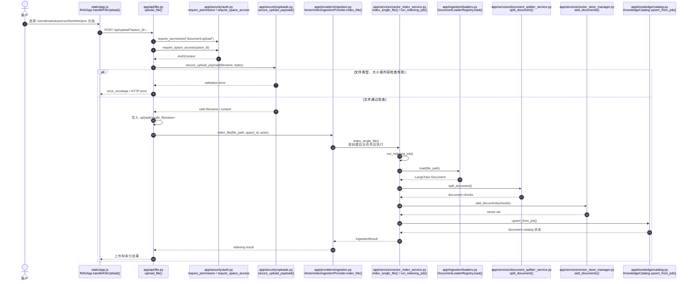

# 文档上传与索引任务

该图描述用户上传文档后，API 如何完成权限校验、上传安全检查、文件落盘、索引 provider 调用、索引任务执行和知识目录更新。

```mermaid
sequenceDiagram
    autonumber
    actor User as 用户
    participant UI as static/app.js<br/>RAGApp.handleFileUpload()
    participant API as app/api/file.py<br/>upload_file()
    participant Auth as app/security/auth.py<br/>require_permission / require_space_access
    participant UploadSec as app/security/uploads.py<br/>secure_upload_payload()
    participant Ingestion as app/providers/ingestion.py<br/>VectorIndexIngestionProvider.index_file()
    participant Index as app/services/vector_index_service.py<br/>index_single_file() / run_indexing_job()
    participant Loaders as app/ingestion/loaders.py<br/>DocumentLoaderRegistry.load()
    participant Splitter as app/services/document_splitter_service.py<br/>split_document()
    participant Store as app/services/vector_store_manager.py<br/>add_documents()
    participant Catalog as app/knowledge/catalog.py<br/>KnowledgeCatalog.upsert_from_job()

    User->>UI: 选择 txt/md/markdown/csv/html/htm/json 文档
    UI->>API: POST /api/upload?space_id=...
    API->>Auth: require_permission("document:upload")
    API->>Auth: require_space_access(space_id)
    Auth-->>API: AuthContext
    API->>UploadSec: secure_upload_payload(filename, bytes)
    alt 文件类型、大小或内容检查失败
        UploadSec-->>API: validation error
        API-->>UI: error_envelope / HTTP error
    else 文件通过检查
        UploadSec-->>API: safe filename / content
        API->>API: 写入 uploads/<safe_filename>
        API->>Ingestion: index_file(file_path, space_id, actor)
        Ingestion->>Index: index_single_file()<br/>或创建后台任务后执行
        Index->>Index: run_indexing_job()
        Index->>Loaders: load(file_path)
        Loaders-->>Index: LangChain Document
        Index->>Splitter: split_document()
        Splitter-->>Index: document chunks
        Index->>Store: add_documents(chunks)
        Store-->>Index: vector ids
        Index->>Catalog: upsert_from_job()
        Catalog-->>Index: document catalog 状态
        Index-->>Ingestion: IngestionResult
        Ingestion-->>API: indexing result
        API-->>UI: 上传和索引结果
    end
```
