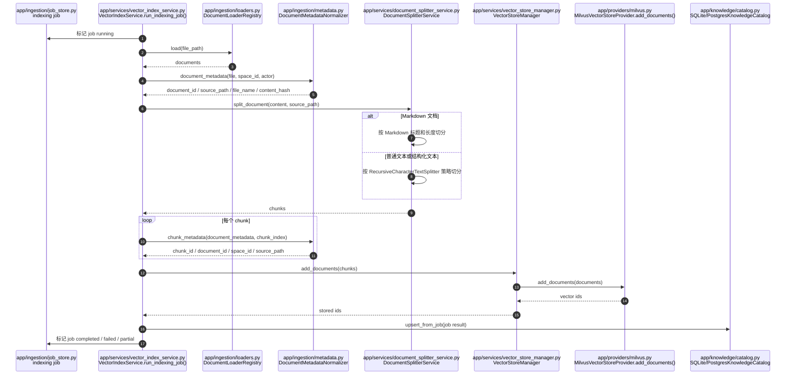

# 文档切分与向量写入细节

该图展开 `VectorIndexService.run_indexing_job()` 内部的加载、元数据归一化、切分、chunk 元数据生成、向量写入和任务状态更新。

```mermaid
sequenceDiagram
    autonumber
    participant Job as app/ingestion/job_store.py<br/>indexing job
    participant Index as app/services/vector_index_service.py<br/>VectorIndexService.run_indexing_job()
    participant Loader as app/ingestion/loaders.py<br/>DocumentLoaderRegistry
    participant Meta as app/ingestion/metadata.py<br/>DocumentMetadataNormalizer
    participant Split as app/services/document_splitter_service.py<br/>DocumentSplitterService
    participant Store as app/services/vector_store_manager.py<br/>VectorStoreManager
    participant Vector as app/providers/milvus.py<br/>MilvusVectorStoreProvider.add_documents()
    participant Catalog as app/knowledge/catalog.py<br/>SQLite/PostgresKnowledgeCatalog

    Index->>Job: 标记 job running
    Index->>Loader: load(file_path)
    Loader-->>Index: documents
    Index->>Meta: document_metadata(file, space_id, actor)
    Meta-->>Index: document_id / source_path / file_name / content_hash
    Index->>Split: split_document(content, source_path)
    alt Markdown 文档
        Split->>Split: 按 Markdown 标题和长度切分
    else 普通文本或结构化文本
        Split->>Split: 按 RecursiveCharacterTextSplitter 策略切分
    end
    Split-->>Index: chunks
    loop 每个 chunk
        Index->>Meta: chunk_metadata(document_metadata, chunk_index)
        Meta-->>Index: chunk_id / document_id / space_id / source_path
    end
    Index->>Store: add_documents(chunks)
    Store->>Vector: add_documents(documents)
    Vector-->>Store: vector ids
    Store-->>Index: stored ids
    Index->>Catalog: upsert_from_job(job result)
    Index->>Job: 标记 job completed / failed / partial
```
