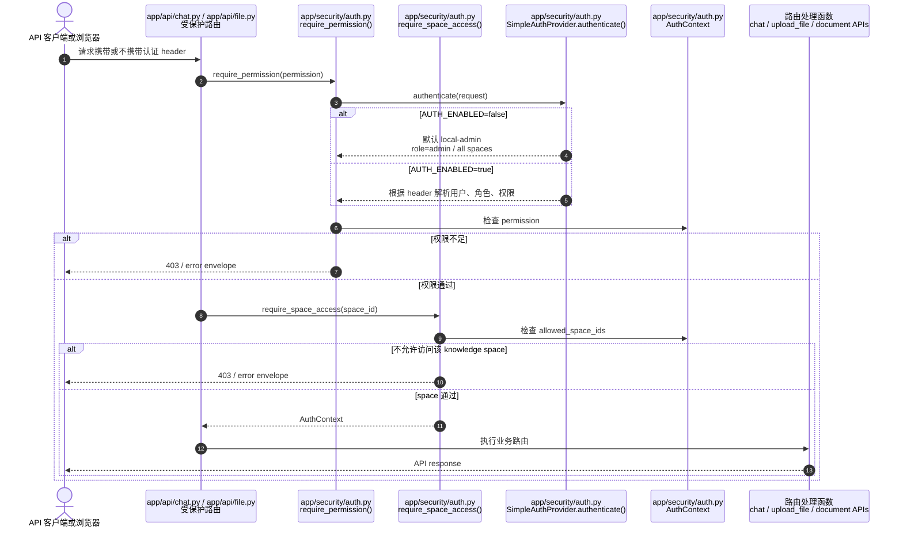

# 权限与知识空间访问

该图描述 chat、upload 和知识空间相关 API 如何通过 `require_permission()` 与 `require_space_access()` 做权限检查。注意：教程中确认本地默认 `AUTH_ENABLED=false` 时会使用 `local-admin/admin/*`。

```mermaid
sequenceDiagram
    autonumber
    actor Client as API 客户端或浏览器
    participant Route as app/api/chat.py / app/api/file.py<br/>受保护路由
    participant AuthDep as app/security/auth.py<br/>require_permission()
    participant SpaceDep as app/security/auth.py<br/>require_space_access()
    participant Provider as app/security/auth.py<br/>SimpleAuthProvider.authenticate()
    participant Context as app/security/auth.py<br/>AuthContext
    participant Handler as 路由处理函数<br/>chat / upload_file / document APIs

    Client->>Route: 请求携带或不携带认证 header
    Route->>AuthDep: require_permission(permission)
    AuthDep->>Provider: authenticate(request)
    alt AUTH_ENABLED=false
        Provider-->>AuthDep: 默认 local-admin<br/>role=admin / all spaces
    else AUTH_ENABLED=true
        Provider-->>AuthDep: 根据 header 解析用户、角色、权限
    end
    AuthDep->>Context: 检查 permission
    alt 权限不足
        AuthDep-->>Client: 403 / error envelope
    else 权限通过
        Route->>SpaceDep: require_space_access(space_id)
        SpaceDep->>Context: 检查 allowed_space_ids
        alt 不允许访问该 knowledge space
            SpaceDep-->>Client: 403 / error envelope
        else space 通过
            SpaceDep-->>Route: AuthContext
            Route->>Handler: 执行业务路由
            Handler-->>Client: API response
        end
    end
```
