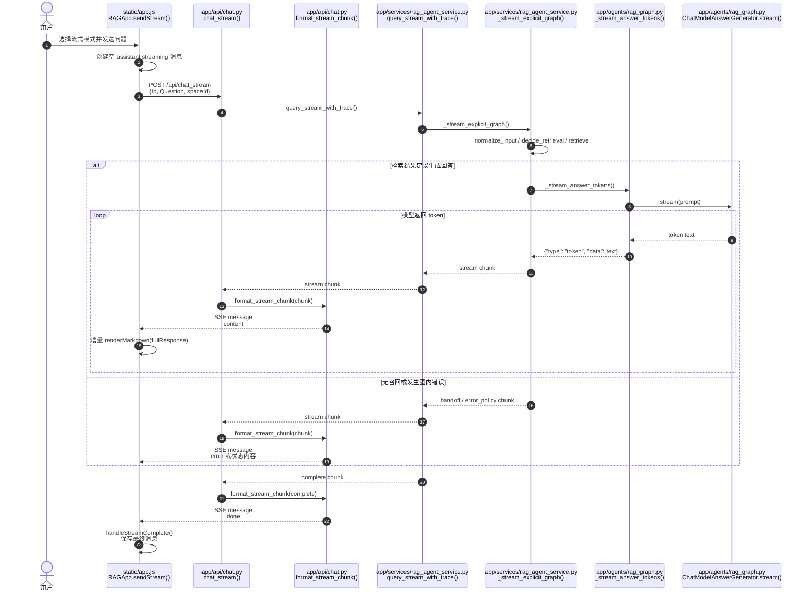

# 流式对话与 SSE

该图描述浏览器使用流式模式调用 `POST /api/chat_stream` 后，后端如何把显式图中的 token、完成事件和错误事件转换成 SSE 消息。

```mermaid
sequenceDiagram
    autonumber
    actor User as 用户
    participant UI as static/app.js<br/>RAGApp.sendStream()
    participant API as app/api/chat.py<br/>chat_stream()
    participant Format as app/api/chat.py<br/>format_stream_chunk()
    participant Service as app/services/rag_agent_service.py<br/>query_stream_with_trace()
    participant Graph as app/services/rag_agent_service.py<br/>_stream_explicit_graph()
    participant Tokens as app/agents/rag_graph.py<br/>_stream_answer_tokens()
    participant LLM as app/agents/rag_graph.py<br/>ChatModelAnswerGenerator.stream()

    User->>UI: 选择流式模式并发送问题
    UI->>UI: 创建空 assistant streaming 消息
    UI->>API: POST /api/chat_stream<br/>{Id, Question, spaceId}
    API->>Service: query_stream_with_trace()
    Service->>Graph: _stream_explicit_graph()
    Graph->>Graph: normalize_input / decide_retrieval / retrieve
    alt 检索结果足以生成回答
        Graph->>Tokens: _stream_answer_tokens()
        Tokens->>LLM: stream(prompt)
        loop 模型返回 token
            LLM-->>Tokens: token text
            Tokens-->>Graph: {"type": "token", "data": text}
            Graph-->>Service: stream chunk
            Service-->>API: stream chunk
            API->>Format: format_stream_chunk(chunk)
            Format-->>UI: SSE message<br/>content
            UI->>UI: 增量 renderMarkdown(fullResponse)
        end
    else 无召回或发生图内错误
        Graph-->>Service: handoff / error_policy chunk
        Service-->>API: stream chunk
        API->>Format: format_stream_chunk(chunk)
        Format-->>UI: SSE message<br/>error 或状态内容
    end
    Service-->>API: complete chunk
    API->>Format: format_stream_chunk(complete)
    Format-->>UI: SSE message<br/>done
    UI->>UI: handleStreamComplete()<br/>保存最终消息
```
