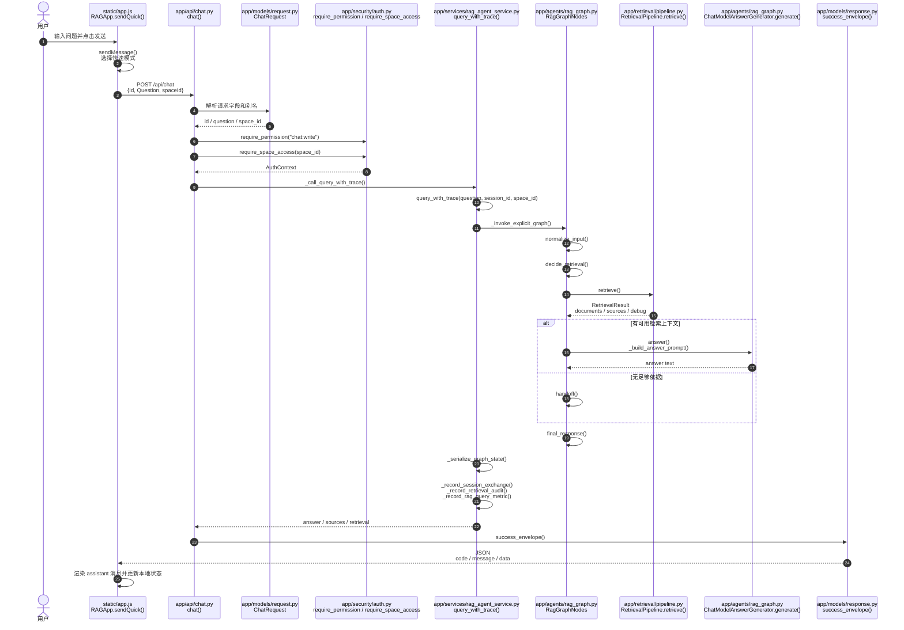

# 用户发起对话

该图描述普通非流式问答从浏览器进入 `POST /api/chat`，再进入显式 RAG 图、检索、生成答案、记录会话和返回前端的主链路。

```mermaid
sequenceDiagram
    autonumber
    actor User as 用户
    participant UI as static/app.js<br/>RAGApp.sendQuick()
    participant API as app/api/chat.py<br/>chat()
    participant Model as app/models/request.py<br/>ChatRequest
    participant Auth as app/security/auth.py<br/>require_permission / require_space_access
    participant Service as app/services/rag_agent_service.py<br/>query_with_trace()
    participant Graph as app/agents/rag_graph.py<br/>RagGraphNodes
    participant Retrieval as app/retrieval/pipeline.py<br/>RetrievalPipeline.retrieve()
    participant LLM as app/agents/rag_graph.py<br/>ChatModelAnswerGenerator.generate()
    participant Response as app/models/response.py<br/>success_envelope()

    User->>UI: 输入问题并点击发送
    UI->>UI: sendMessage()<br/>选择快速模式
    UI->>API: POST /api/chat<br/>{Id, Question, spaceId}
    API->>Model: 解析请求字段和别名
    Model-->>API: id / question / space_id
    API->>Auth: require_permission("chat:write")
    API->>Auth: require_space_access(space_id)
    Auth-->>API: AuthContext
    API->>Service: _call_query_with_trace()
    Service->>Service: query_with_trace(question, session_id, space_id)
    Service->>Graph: _invoke_explicit_graph()
    Graph->>Graph: normalize_input()
    Graph->>Graph: decide_retrieval()
    Graph->>Retrieval: retrieve()
    Retrieval-->>Graph: RetrievalResult<br/>documents / sources / debug
    alt 有可用检索上下文
        Graph->>LLM: answer()<br/>_build_answer_prompt()
        LLM-->>Graph: answer text
    else 无足够依据
        Graph->>Graph: handoff()
    end
    Graph->>Graph: final_response()
    Service->>Service: _serialize_graph_state()
    Service->>Service: _record_session_exchange()<br/>_record_retrieval_audit()<br/>_record_rag_query_metric()
    Service-->>API: answer / sources / retrieval
    API->>Response: success_envelope()
    Response-->>UI: JSON<br/>code / message / data
    UI->>UI: 渲染 assistant 消息并更新本地状态
```
