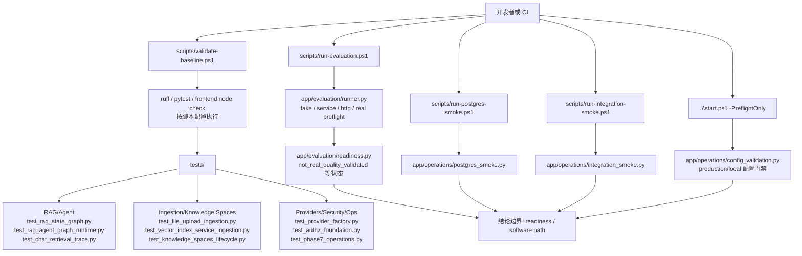

# 评估测试与运维门禁

该图描述本项目当前测试、评估和运维脚本的入口关系。它们能验证软件路径和 readiness，但不等同于真实 DashScope/Milvus/Postgres 的生产质量证明。

```mermaid
flowchart TD
    A["开发者或 CI"] --> B["scripts/validate-baseline.ps1"]
    B --> C["ruff / pytest / frontend node check<br/>按脚本配置执行"]
    C --> D["tests/"]
    D --> D1["RAG/Agent<br/>test_rag_state_graph.py<br/>test_rag_agent_graph_runtime.py<br/>test_chat_retrieval_trace.py"]
    D --> D2["Ingestion/Knowledge Spaces<br/>test_file_upload_ingestion.py<br/>test_vector_index_service_ingestion.py<br/>test_knowledge_spaces_lifecycle.py"]
    D --> D3["Providers/Security/Ops<br/>test_provider_factory.py<br/>test_authz_foundation.py<br/>test_phase7_operations.py"]
    A --> E["scripts/run-evaluation.ps1"]
    E --> F["app/evaluation/runner.py<br/>fake / service / http / real preflight"]
    F --> G["app/evaluation/readiness.py<br/>not_real_quality_validated 等状态"]
    A --> H["scripts/run-postgres-smoke.ps1"]
    H --> I["app/operations/postgres_smoke.py"]
    A --> J["scripts/run-integration-smoke.ps1"]
    J --> K["app/operations/integration_smoke.py"]
    A --> L[".\\start.ps1 -PreflightOnly"]
    L --> M["app/operations/config_validation.py<br/>production/local 配置门禁"]
    G --> N["结论边界: readiness / software path"]
    I --> N
    K --> N
    M --> N
```
